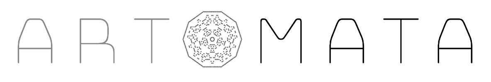
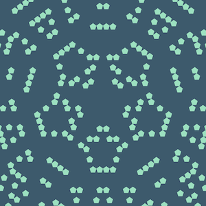
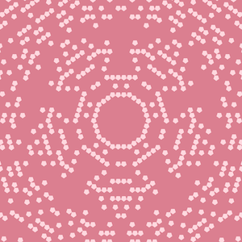
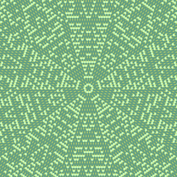
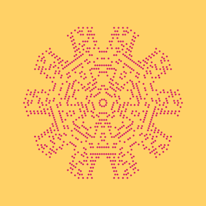

# artomata

art + cellular automata

an experiment

[artomata.tyleryasaka.me](http://artomata.tyleryasaka.me/)

## Examples

These are some examples of artwork generated with this code:

## Development

All of the artomata code is open source and contained in this repo. There are several components.

### [pentaflower](./packages/pentaflower)

This is the javascript library that powers the pentaflower. [Documentation here.](./packages/pentaflower)

Note that the source code is under `packages/pentaflower`.

### [pentaflower-svg](./packages/pentaflower-svg)

This is an extension of the pentaflower class that renders the pentaflower in the broswer. [Documentation here.](./packages/pentaflower-svg)

Note that the source code is under `packages/pentaflower-svg`.

### [website](./docs)

This is the source for the [artomata.tyleryasaka.me](http://artomata.tyleryasaka.me/) website. It's a static site built with jekyll. The code is in the `docs` folder.
